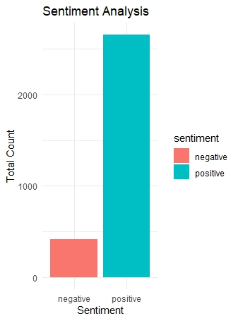
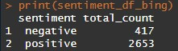

# Sentiment Analysis using Bing Lexicon

## The motive of this project is to find out the customer satisfaction of some residential hotels of Dhaka. This project was done in RStudio with R programming language. The dataset was created through web scraping using parsing method. Almost 5,000 reviews were collected of 8 hotels in Dhaka City. In this project almost 600 reviews were used of only 1 hotel.

The methods followed in this project are:
1. Data Collecting
2. Data Processing
3. Sentiment Analysis

## Data Collecting

*Tools Used*
- RStudio
- R programming language
- Selector Gadget (Chrome extension)

*Libraries Used*
- rvest
- dplyr

## Data Processing

*Tools Used*
- RStudio
- R programming language

*Libraries Used*
- openxlsx
- readxl
- stringr
- tm

## Sentiment Analysis

*Tools Used*
- RStudio
- R programming language
- Bing Lexicon

*Libraries Used*
- readxl
- tidyverse
- tidytext
- ggplot2

## For detailed documentation please visit and download files from the link
(https://github.com/Tanzim-prog/sentiment_analysis_bing_lexicon/tree/master/Documentation)